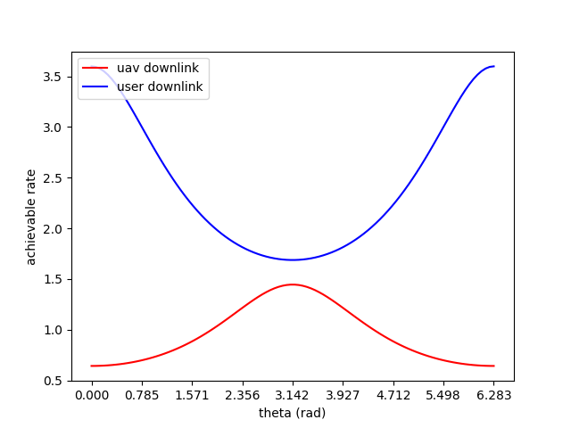

In the meeting, we were going over this plot that I generated, reproducing the results of this paper. The setup that I'm using looks sort of like this
```
                             (UAV flight path)
                             _..----------..
                          .-~                -.
                          |.        x         .| (radius = 30m)
                           "-..___________..-"
                                    |
                                    |
                                    |  (h = 30m)
                                    |
                                    |
                                    |
        (BS distance = 100m)        | (User distance = 30m)
BS ---------------------------------.-------------------- User
```

which results in this plot. This is as expected, the user downlink rate is fastest when the UAV is closest to the user, and the UAV downlink (BS -> UAV rate) is fastest when the UAV is close to the BS.
The equation I'm using to calculate this is just

> log2(1 + transmit power / noise power)

Where transmit power is a constant over distance^2 and noise power is constant. There are a few more things to add to this plot
- Small-scale fading
- Average downlink rate considering a sampling of user positions in the dead zone
- Outage probability vs theta considering a sampling of user positions in the dead zone
- Combine UAV and user downlink using a fixed timeshare

Over the next couple of weeks, we are going to do a more thorough literature review so we can get a better idea of what is missing from current research, and where the project can go from here.